  

  
  
  

---

## ⚡ About Me

<table align="center" width="100%">
  <tr>
    <td width="55%" valign="top">
      <h3>🤖 AI & Data Science Explorer</h3>
      
I am a passionate <b>B.Tech CSE Graduate</b> specializing in <b>Artificial Intelligence & Machine Learning</b>. I love building smart systems, performing complex data analysis, and crafting intuitive full-stack web applications.

      <ul>
        <li>🌱 Currently researching: <b>Generative AI, Large Language Models (LLMs), and MLOps</b></li>
        <li>🔭 Working on: <b>Integrating AI Models with Full-Stack Architectures</b></li>
        <li>🎯 Goal: <b>Becoming a full-time AI/ML Engineer</b></li>
      </ul>
    </td>
    <td width="45%" valign="top" align="center">
      <h3>📈 Coding Consistency</h3>
      
    </td>
  </tr>
</table>

<b>💼 View Academic Details & Highlights</b>

 

- 🎓 **Education**: Bachelor of Technology (B.Tech) in Computer Science & Engineering.
- 🧪 **Specialization**: Deep Learning, NLP, Data Preprocessing, Feature Engineering, Model Optimization.
- 💡 **Core Strengths**:
  - Developing and tuning machine learning models (Regression, Classification, Clustering).
  - Designing full-stack architectures integrating modern generative AI APIs.
  - Wrangling and analyzing data using Python pandas/numpy stack to deliver actionable insights.

---

## 🏆 Credentials & Badges

  
  
  
  

---

## 🛠️ Skills & Technologies

| Category | Technologies & Tools |
| :--- | :--- |
| **Languages** |      |
| **AI / ML / Data Science** |     |
| **Data Analytics** |    |
| **Web Dev & Tools** |     |

### 📊 Expertise & Proficiency

- **Machine Learning & Deep Learning**
  
- **Data Analysis & Preprocessing**
  
- **Full-Stack Web Development (React/Node)**
  
- **Software Engineering & Data Structures**
  

---

## 🚀 Featured Projects

<table align="center" width="100%">
  <tr>
    <td width="50%" valign="top">
      <h3>🤖 PathAI (Career Guidance Platform)</h3>
      
An AI-powered full-stack career advisor using the Gemini API, featuring customized dashboards, quizzes, and live AI counseling.

      <ul>
        <li><b>AI Career Counseling</b>: Integrated Gemini Pro API with conversational memory for interactive counseling.</li>
        <li><b>Skills Profiling</b>: Built diagnostic quizzes to map student interests to career options.</li>
        <li><b>Custom Dashboards</b>: Designed progress tracking panels for personalized milestone management.</li>
      </ul>
      

        <code style="background-color: #1e293b; color: #f7df1e; border: 1px solid #d6ba18; border-radius: 4px; padding: 2px 6px; font-size: 11px; font-weight: bold; font-family: monospace;">JavaScript</code> 
        <code style="background-color: #1e293b; color: #61dafb; border: 1px solid #00b0ff; border-radius: 4px; padding: 2px 6px; font-size: 11px; font-weight: bold; font-family: monospace;">React</code> 
        <code style="background-color: #1e293b; color: #39aa56; border: 1px solid #238c3f; border-radius: 4px; padding: 2px 6px; font-size: 11px; font-weight: bold; font-family: monospace;">Node.js</code>
        <code style="background-color: #1e293b; color: #8e75c2; border: 1px solid #735aa6; border-radius: 4px; padding: 2px 6px; font-size: 11px; font-weight: bold; font-family: monospace;">Gemini API</code>
      

    </td>
    <td width="50%" valign="top">
      <h3>📊 Data Analytics Dashboard</h3>
      
Power BI and Python-based interactive dashboards analyzing student learning stats, job trends, and performance metrics.

      <ul>
        <li><b>KPI Tracking</b>: Developed key metrics to measure student engagement and performance.</li>
        <li><b>Data Wrangling</b>: Cleaned and structured raw analytics data using Pandas and NumPy.</li>
        <li><b>Interactive Reports</b>: Modeled cross-filtering dashboards for cross-departmental insights.</li>
      </ul>
      

        <code style="background-color: #1e293b; color: #3776ab; border: 1px solid #1f5380; border-radius: 4px; padding: 2px 6px; font-size: 11px; font-weight: bold; font-family: monospace;">Python</code> 
        <code style="background-color: #1e293b; color: #f2c811; border: 1px solid #cca100; border-radius: 4px; padding: 2px 6px; font-size: 11px; font-weight: bold; font-family: monospace;">Power BI</code> 
        <code style="background-color: #1e293b; color: #c881f5; border: 1px solid #9e4bc4; border-radius: 4px; padding: 2px 6px; font-size: 11px; font-weight: bold; font-family: monospace;">Pandas</code>
      

    </td>
  </tr>
  <tr>
    <td width="50%" valign="top">
      <h3>🧠 Machine Learning Models</h3>
      
Supervised and unsupervised learning models built with Scikit-Learn to predict house prices, segment customers, and classify text.

      <ul>
        <li><b>Price Prediction</b>: Built regression models to estimate real estate valuations with R² > 0.85.</li>
        <li><b>Customer Clustering</b>: Developed K-Means pipelines to segment customer data for targeted marketing.</li>
        <li><b>Text Classifier</b>: Created TF-IDF feature pipelines for sentiment classification.</li>
      </ul>
      

        <code style="background-color: #1e293b; color: #3776ab; border: 1px solid #1f5380; border-radius: 4px; padding: 2px 6px; font-size: 11px; font-weight: bold; font-family: monospace;">Python</code> 
        <code style="background-color: #1e293b; color: #f7931e; border: 1px solid #d97800; border-radius: 4px; padding: 2px 6px; font-size: 11px; font-weight: bold; font-family: monospace;">Scikit-Learn</code> 
        <code style="background-color: #1e293b; color: #013243; border: 1px solid #005a7d; border-radius: 4px; padding: 2px 6px; font-size: 11px; font-weight: bold; font-family: monospace;">NumPy</code>
      

    </td>
    <td width="50%" valign="top">
      <h3>🌐 AI Chatbot</h3>
      
A smart chatbot utilizing Python, NLP techniques, and NLTK/spacy to guide users and address product FAQs interactively.

      <ul>
        <li><b>NLU Pipeline</b>: Built intent classification using NLTK and SpaCy tokenization and parsing.</li>
        <li><b>Context Management</b>: Enabled multi-turn conversations for answering product FAQs.</li>
        <li><b>Performance</b>: Served light API endpoints with latency under 200ms.</li>
      </ul>
      

        <code style="background-color: #1e293b; color: #3776ab; border: 1px solid #1f5380; border-radius: 4px; padding: 2px 6px; font-size: 11px; font-weight: bold; font-family: monospace;">Python</code> 
        <code style="background-color: #1e293b; color: #ff6f00; border: 1px solid #d95b00; border-radius: 4px; padding: 2px 6px; font-size: 11px; font-weight: bold; font-family: monospace;">NLTK</code> 
        <code style="background-color: #1e293b; color: #00bcd4; border: 1px solid #0097a7; border-radius: 4px; padding: 2px 6px; font-size: 11px; font-weight: bold; font-family: monospace;">SpaCy</code>
      

    </td>
  </tr>
</table>

---

## 📊 GitHub Analytics

<table align="center" width="100%">
  <tr>
    <td width="50%" align="center">
      
    </td>
    <td width="50%" align="center">
      
    </td>
  </tr>
</table>

  <b>Contribution Activity Graph</b> 
  

  <b>Contribution Grid Snake Game</b> 
  <picture>
    <source media="(prefers-color-scheme: dark)" srcset="https://raw.githubusercontent.com/Adiipandit255/Adiipandit255/output/github-contribution-grid-snake-dark.svg" />
    <source media="(prefers-color-scheme: light)" srcset="https://raw.githubusercontent.com/Adiipandit255/Adiipandit255/output/github-contribution-grid-snake.svg" />
    
  </picture>

---

## 💻 My Dev Environment

  
  
  
  
  

---

## 🌐 Connect With Me

  
  
  
  

---

  

  <i>"Turning ideas into intelligent solutions with AI."</i> 🚀

